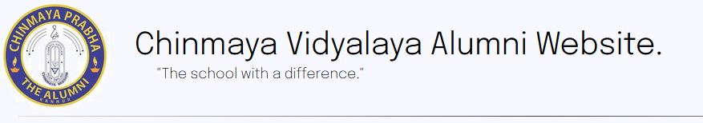

# Documentation
 
- What you're reading right now is the documentation for the website, if you aren't viewing this through a markdown viewer, access this link https://github.com/AnkithAbhayan/alumni_website_submission/blob/main/README.md to view it the way its intended to be viewed.
## Built by the hunterwolf developers
### Team Members:  
- Ankith Abhayan  
- Nived p Manoj  
## Technologies used
- `HTMl`, `CSS` and `JS` for the front-end.
- `Markdown` for the documentation you're reading right now.
- `Python` for running it at `localhost:8000`  
  
##  What we prioritized and what we didn't
### User-Interface/Front-end
- We have a built a fully static website which satisfies all the user requirements.
- We directed our attention to the user-interface and the visual components of the website trying to make it as user-friendly, straightforward and interactive as possible.
- We did not spend time thinking about how the website would look when accessed via a mobile phone or a tablet, we've built it in such a way that it looks good on a screen which has an aspect ratio of `16:9`.

### Backend
- We did not spend much time on the backend of the website since we thought it would take a lot of time.
- We did not make use of Database management systems, APIs nor anything in between.

## Our philosophy
There are a few ideals that we've withheld throughout.  
Lines extracted from the [zen of python](https://en.wikipedia.org/wiki/Zen_of_Python) by [`Tim Peters`](https://en.wikipedia.org/wiki/Tim_Peters_(software_engineer)): 
- Beautiful is better than ugly.
- Simple is better than complex.
- Complex is better than complicated.

## Features
### Font
- We used the `Epilogue` font across all webpages.
- It is a free and open-source font.

### It's fast!
- We've ensured that the website is:
  - light-weight 
  - astonishingly fast 
  - minimalistic and easy to navigate

### Conclusion
- We built the entire website spanning across multiple webpages from the ground-up without the use of any other tool than a texteditor for writing the code.
- No use of templates, external software that lets you drag and drop widgets into the screen to create webpages, none.